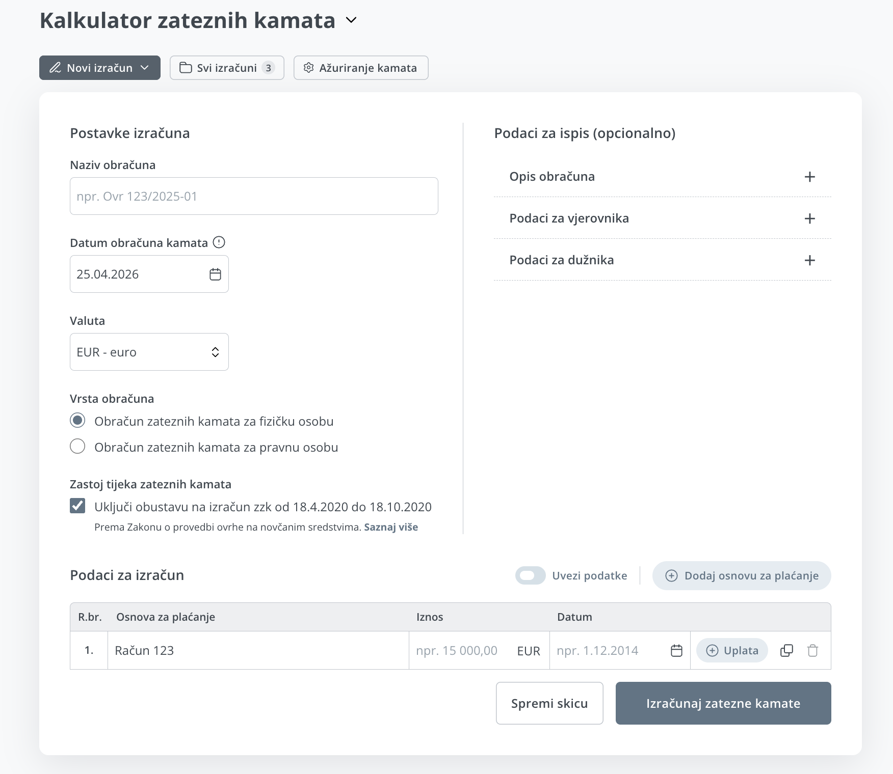
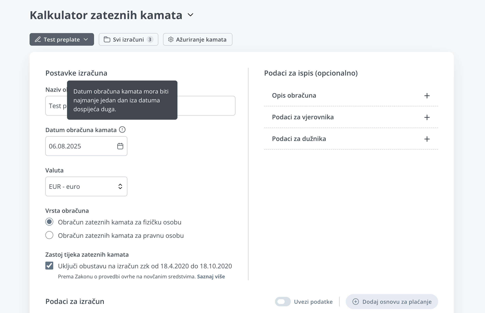
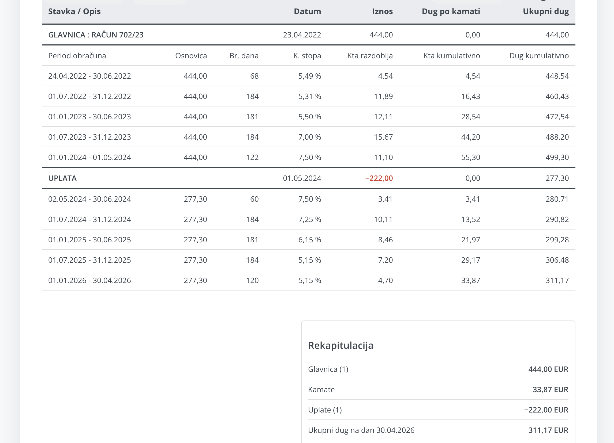
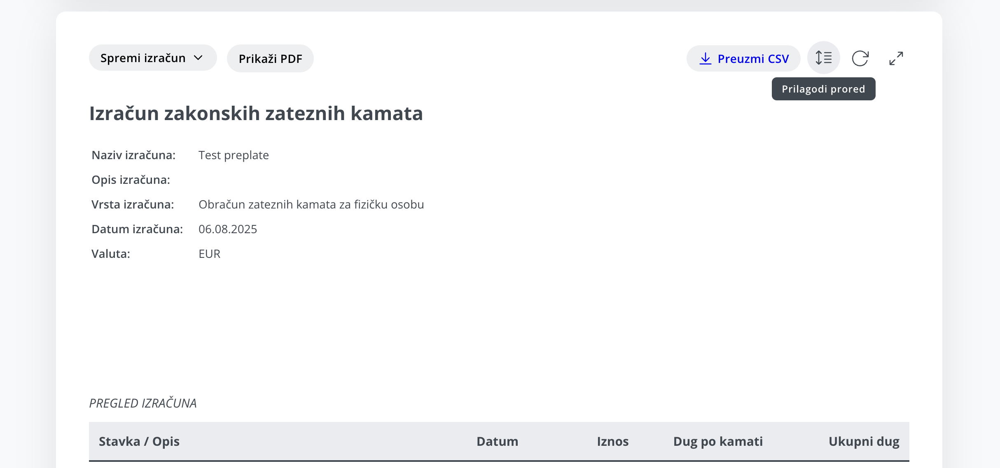
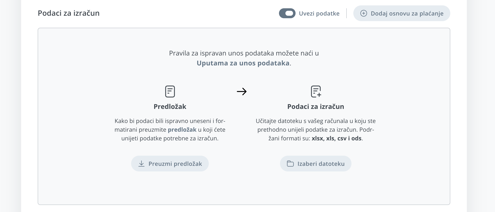
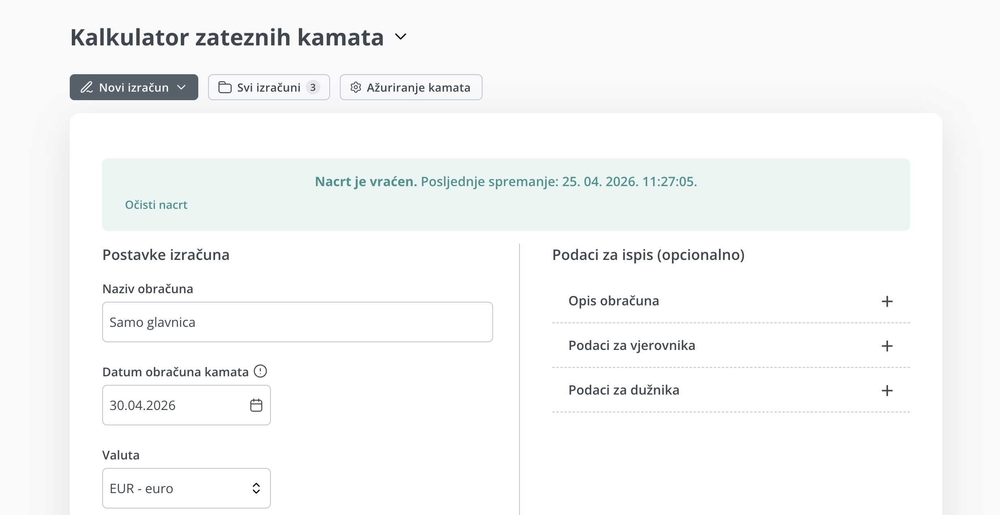
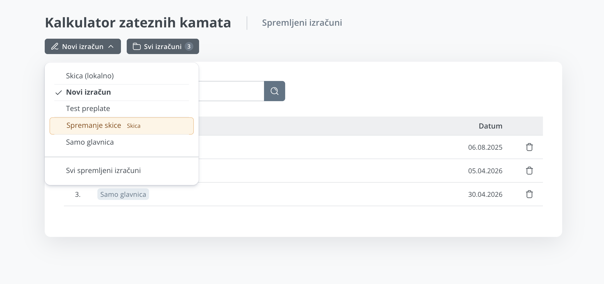
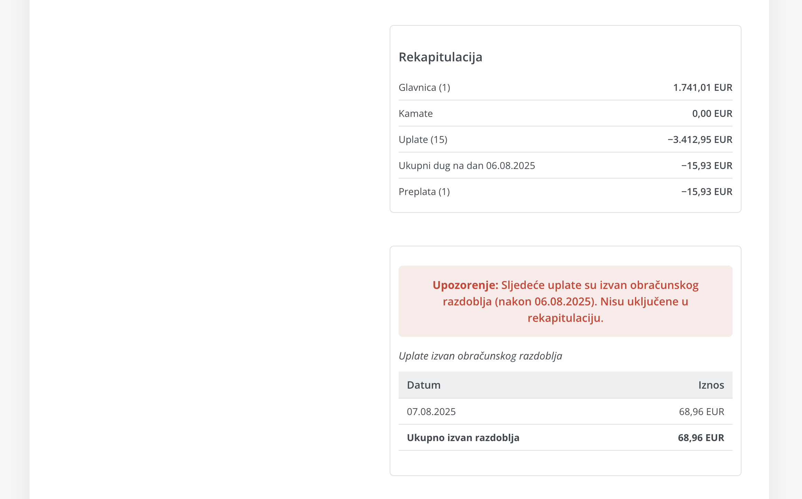

# Izračun Kamata (Demo)

Web aplikacija za obračun zakonskih zateznih kamata s podrškom za više glavnica, više uplata, promjene kamatnih stopa kroz razdoblja i izvoz rezultata.

## Live Demo

[https://izracun-kamata.onrender.com/](https://izracun-kamata.onrender.com/)

## O projektu

Ovaj projekt je izrađen kao praktičan alat za izračun kamata u poslovnim i administrativnim scenarijima (npr. odvjetnički uredi, računovodstvo, uredsko poslovanje).

Aplikacija omogućuje:
- unos jedne ili više glavnica
- unos više uplata po glavnici
- automatski obračun kamata po razdobljima
- podršku za moratorij razdoblje (0% kamata)
- prikaz detaljne tablice obračuna
- uvoz podataka za izračun iz xlsx, xls, csv i ods
- izvoz rezultata u PDF i CSV

## Ključne funkcionalnosti

- Dinamički unos stavki (glavnica + uplate)
- Obračun prema definiranim kamatnim stopama po periodima
- Korektno razdvajanje perioda kod uplata unutar obračunskog razdoblja
- Rekapitulacija (glavnica, kamate, uplate, ukupni dug/preplata)
- Fokus prikaz rezultata radi lakše provjere i ispisa
- Demo zaštita: verifikacija email koda + ograničen broj demo izračuna

## Korištene tehnologije

- **Backend:** Python, Flask
- **Frontend:** HTML, CSS, Vanilla JavaScript
- **Baza podataka:** SQLite
- **Generiranje PDF-a:** wkhtmltopdf / WeasyPrint fallback
- **Deploy:** Render (Web Service)

## Arhitektura (high-level)

- Flask backend prima podatke iz forme i vraća strukturirani rezultat obračuna.
- Frontend prikazuje tablični pregled i rekapitulaciju.
- Rezultat se može izvesti u PDF i CSV.
- U demo modu koristi se email verifikacija prije izračuna.

## Screenshots

## Status

- Aktivno korišten kao demonstracijski (portfolio) projekt.
- Demo okruženje je optimizirano za prikaz funkcionalnosti.

## Source Code

Izvorni kod je privatan i nije javno dostupan u ovom repozitoriju.  
Ovaj repozitorij služi kao **portfolio showcase** s live demonstracijom.

## Kontakt

Za tehnički walkthrough ili dodatne informacije o implementaciji, slobodno se javite.
